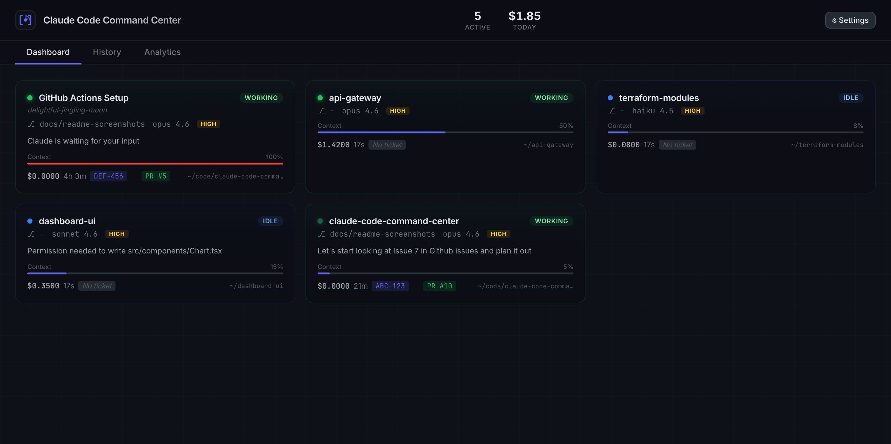
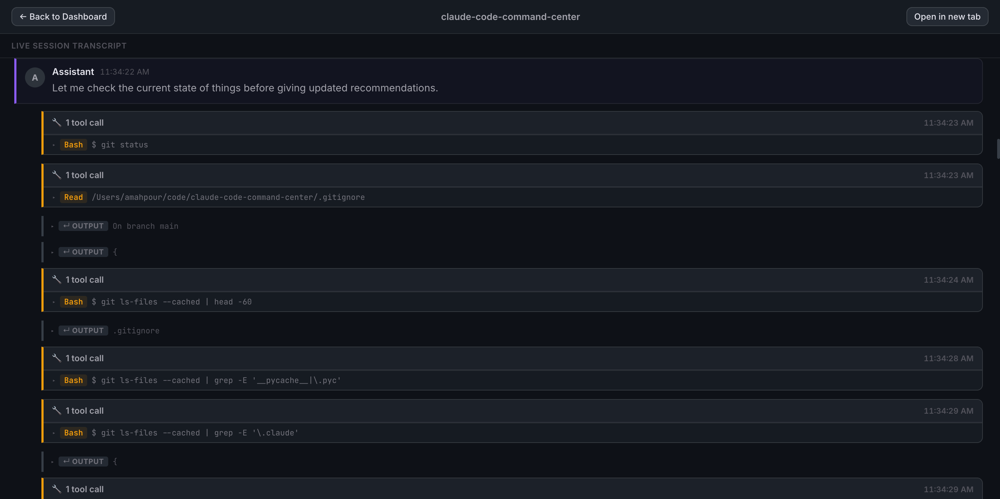

# Claude Code Command Center

A web-based command center for monitoring and managing multiple Claude Code sessions in real-time.





## Features

- **Live Dashboard** — At-a-glance view of all active Claude Code sessions with status indicators, context usage, and cost tracking
- **Live Transcripts** — Click any session to view its conversation in real-time with collapsible tool calls
- **Session History** — Browse past sessions with full-text search across transcripts
- **Analytics** — Track token usage, costs, and session patterns with interactive charts
- **Jira Integration** — Auto-detects ticket IDs from git branch names (e.g., `feature/PROJ-42-login` → `PROJ-42`) with clickable links to Jira. Configure project keys and server URL in Settings.
- **PR/MR Links** — GitHub pull request and GitLab merge request links on session cards
- **Hook Integration** — Automatically captures session events via Claude Code hooks
- **JSONL Watcher** — Monitors `~/.claude/projects/` for transcript changes in real-time

## Prerequisites

- Python 3.12+
- Claude Code CLI

## Quick Start

### Install from GitHub

```bash
pip install git+https://github.com/amahpour/claude-code-command-center.git
```

### Or clone and install locally

```bash
git clone https://github.com/amahpour/claude-code-command-center.git
cd claude-code-command-center
pip install .
```

### Run

```bash
# Install Claude Code hooks
bash scripts/setup.sh

# Start the server
uvicorn server.main:app --port 3000
```

Then open **http://localhost:3000** in your browser.

## Architecture

```
Browser (localhost:3000)
  |
  |-- REST API (/api/*)      -- Sessions, history, search, analytics
  |-- WebSocket (/ws/*)      -- Real-time dashboard updates
  |-- Static Files (/*)      -- Dashboard HTML/CSS/JS
  |
FastAPI + uvicorn
  |
  |-- Hook Handler            -- Receives events from Claude Code hooks
  |-- JSONL Watcher           -- Monitors ~/.claude/projects/ for transcript changes
  |-- SQLite + FTS5           -- Persistent storage with full-text search
```

### How It Works

1. **Hook Installation** — `scripts/setup.sh` adds hooks to `~/.claude/settings.json` that call `scripts/hook-handler.py` on every Claude Code event
2. **Event Capture** — The hook handler POSTs event data to the server's `/api/hooks` endpoint
3. **Session Tracking** — The server maintains session state (status, cost, tokens, context usage) in SQLite
4. **Real-time Updates** — WebSocket broadcasts push session changes to all connected dashboard clients
5. **Transcript Indexing** — The JSONL file watcher parses Claude Code session files and indexes them for full-text search

### Session Status Flow

| Status | Color | Meaning |
|--------|-------|---------|
| Working | Green | Tool calls in progress |
| Waiting | Yellow | Needs user input/permission |
| Idle | Blue | Session open, agent not running |
| Stale | Grey | No activity for 5+ minutes |
| Completed | Grey | Session ended |

## API Reference

| Endpoint | Method | Description |
|----------|--------|-------------|
| `/api/health` | GET | Health check |
| `/api/sessions` | GET | List active sessions |
| `/api/sessions/:id` | GET | Get session with events |
| `/api/sessions/:id/transcript` | GET | Get session transcript |
| `/api/hooks` | POST | Receive hook events |
| `/api/history` | GET | Paginated session history |
| `/api/search?q=query` | GET | Full-text transcript search |
| `/api/settings` | GET | Get app settings |
| `/api/settings` | PUT | Update app settings |
| `/api/sessions/:id` | PATCH | Update session fields (e.g., ticket_id) |
| `/api/analytics/summary` | GET | Token/cost summary |
| `/api/analytics/daily` | GET | Daily usage breakdown |

## Tech Stack

- **Backend:** Python 3.12+ / FastAPI / uvicorn / aiosqlite
- **Frontend:** Vanilla HTML/CSS/JS with xterm.js (CDN, no build step)
- **Database:** SQLite with FTS5 full-text search
- **Testing:** pytest + pytest-asyncio (unit), Playwright (e2e)

## Development

```bash
# Run tests
source .venv/bin/activate
pytest

# Run with auto-reload
uvicorn server.main:app --port 3000 --reload
```

## Uninstalling

```bash
# Remove hooks from Claude Code settings
bash scripts/uninstall.sh
```

## Project Structure

```
server/
  main.py          — FastAPI app entry point
  db.py            — SQLite database layer
  hooks.py         — Hook event processing
  watcher.py       — JSONL file watcher
  routes/
    api.py         — REST API endpoints
    ws.py          — WebSocket handlers

public/
  index.html       — Dashboard page
  css/style.css    — Dark theme styles
  js/
    app.js         — Main app + WebSocket
    dashboard.js   — Session card grid
    terminal.js    — xterm.js terminal view
    history.js     — Session history browser
    analytics.js   — Charts and stats

scripts/
  setup.sh         — Install hooks
  uninstall.sh     — Remove hooks
  hook-handler.py  — Hook event forwarder
```

## Acknowledgments

Inspired by Marc Nuri's [AI Coding Agent Dashboard](https://blog.marcnuri.com/ai-coding-agent-dashboard).

## License

MIT
